# GM Tools: Upgradable Runic Items

A Foundry VTT module for D&D 5e that lets GMs inscribe named runes onto weapons and armor, granting combat effects, stat boosts, feats, and spells. Designed for fast, thematic item upgrades without the overhead of crafting systems.

---

## What It Does

Each weapon or armor item sheet gains a **Solvarian Runecraft** panel in the Details tab with three upgrade tracks:

- **Runic Power** - up to 3 active combat runes that trigger automatically in combat
- **Runic Empowerment** - up to 5 ability score boosts, each adding +1 to the chosen stat
- **Runic Legacy** - one feat and one spell granted directly from any loaded compendium

Runes activate when the item is equipped (and attuned if required). Effects fire through Foundry's hook system, so no macro setup or manual triggering is required. A few effects that impose attack-roll disadvantage rely on midi-qol to enforce automatically. See Compatibility Notes.

  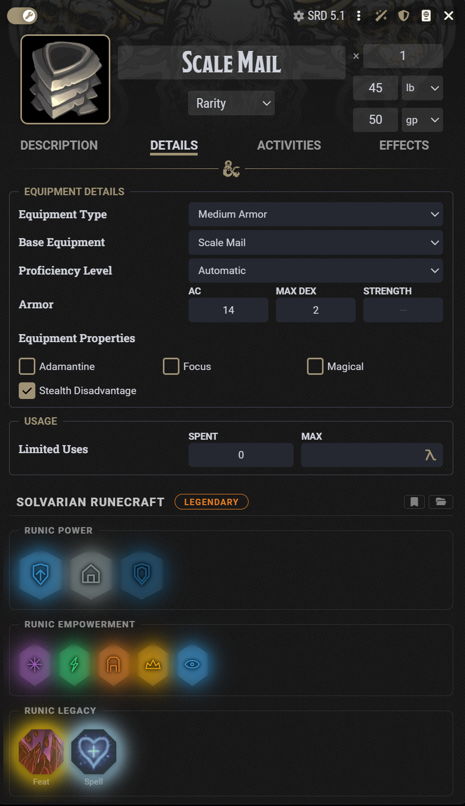

---

## Features

- **18 power runes** across melee weapons, ranged weapons, and armor; each with distinct combat effects that fire automatically on hits, crits, and turn events
- **6 combo runes** that appear when all 3 power slots form a matched trio. The combo slot animates into existence with a forge effect and its own unique glyph & tooltip 
- **Rarity system** that upgrades automatically as slots are filled, from Common through Legendary, adjusting the effect die used by power runes
- **Rune presets** - save any item's rune configuration as a named preset and load it onto compatible items in one click
- **Visual crack indicator** - if an actor's stats would be pushed over 30 by empowerment, or if a legacy feat/spell conflicts with another runic item, a color-coded crack appears on the relevant section with an explanation
- **Compendium legacy picker** - loads feats and spells from all loaded compendiums on first use and includes search filtering
- **Role-based access** - configurable minimum role required to edit runes; players below the threshold see slots in read-only mode
- **Fully localized** - all user-visible strings in `lang/en.json` and more to come as I have time

  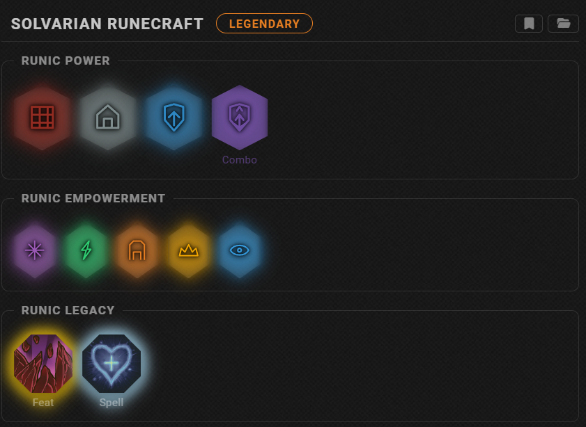
   
  <em>The Combo slot animates into existence when all three power runes form a matched trio.</em>

  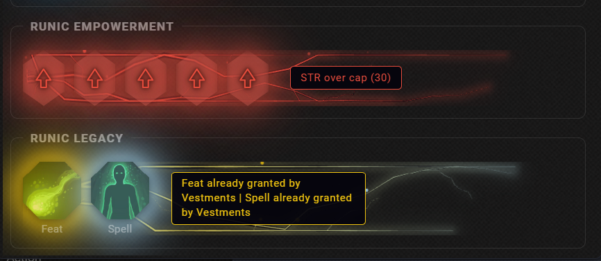
   
  <em>Crack indicators flag an over-cap ability score and a legacy feat/spell already granted by another item.</em>

---

## Rune Categories

### Melee Weapons
Stonecleft, Mirageward, Emberbrand, Sandgrasp, Ruinmark, Forgebell

### Ranged Weapons
Burntrace, Sandhold, Ashcloud, Undertow, Scorcheye, Wasteblight

### Armor
Emberveil, Stonewarden, Vanguard, Wardpulse, Forgeshield, Ashen Mantle

### Combos (2 per category, requires all 3 power slots)
Ember Surge, Rift Break, Crystal Anchor, Blight Field, Ironwall, Morrain's Resolve

---

## Requirements

| Requirement | Version |
|-------------|---------|
| Foundry VTT | 12+ |
| D&D 5e System | 4.0.0 - 5.x |

---

## Installation

**Via Foundry module browser:** search for `GM Tools: Upgradable Runic Items`

**Manual:**
1. Open Foundry's Add-on Modules tab
2. Click **Install Module**
3. Paste the manifest URL and install
4. Enable the module in your world's module settings

---

## Quick Start

1. Open any weapon or armor item sheet
2. Navigate to the **Details** tab
3. Click any empty socket in the Solvarian Runecraft panel to open the rune picker
4. Select a rune and effects activate automatically when the item is equipped and attuned (if required)
5. The rarity badge updates as you fill slots

---

## Settings

| Setting | Description |
|---------|-------------|
| Minimum Role to Edit Runes | Lowest user role that can assign runes. Defaults to Game Master. |
| Compendium Cache | Manage the feat/spell index used by the legacy picker. |
| Rune Presets | Open the preset manager to view and delete saved configurations. |

  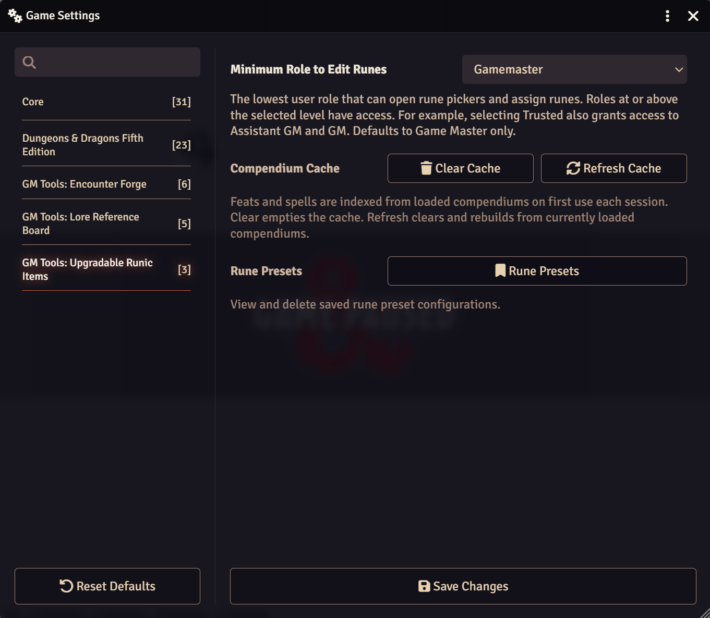

  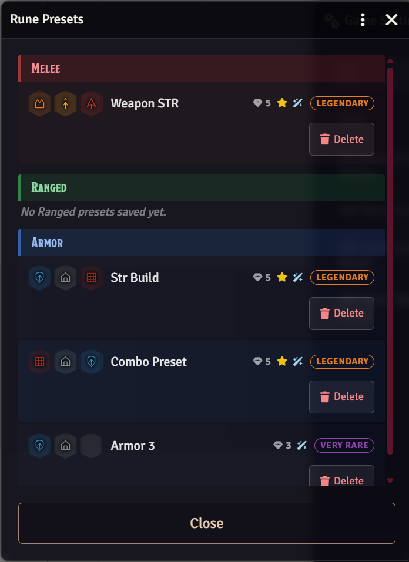

---

## Compatibility Notes

- Vanguard's Guardian's Rush moves tokens and requires an active combat encounter.
- Legacy grants add items directly to the actor's item list tagged with the source item's name.
- Attack-roll disadvantage (Burntrace, Vanguard's Guardian's Rush, and the Crystal Anchor combo) is applied through a midi-qol flag. Without midi-qol installed, those effects still appear on the target as a reminder but do not enforce the disadvantage automatically. The ability-check disadvantage from Crystal Anchor is automated in core dnd5e 4.1+.
- Ashcloud (and the cloud spawned by the Blight Field combo) only rolls saves and applies poison damage for hostile NPC tokens. Allied and player tokens standing in the cloud are not affected by the automation.
- The in-sheet panel is titled **Solvarian Runecraft**.

---

## Screenshots

### Assigning runes

Click any empty socket to open its picker. Power runes show a tooltip describing their combat effect; empowerment runes each add +1 to the chosen ability.

  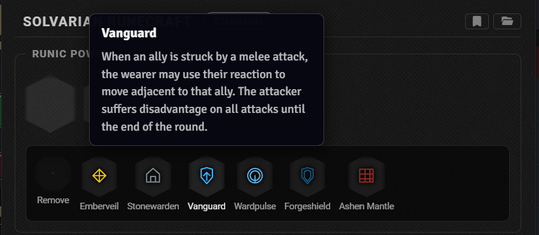
  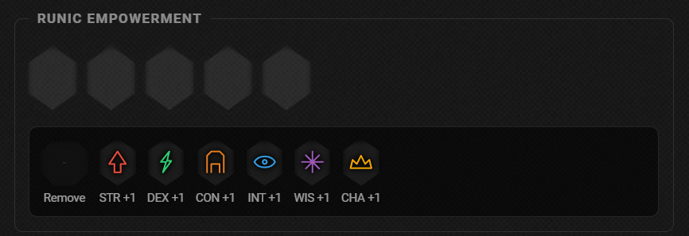

### Legacy feats and spells

The legacy sockets load feats and spells from every loaded compendium, with live search filtering.

  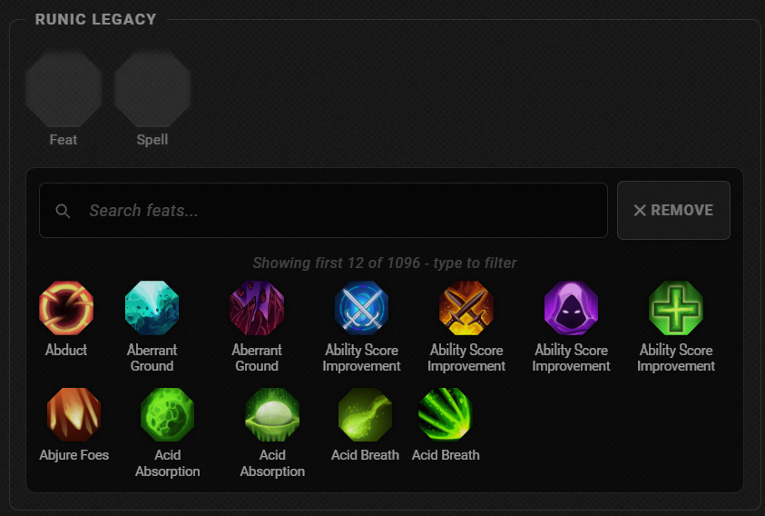
  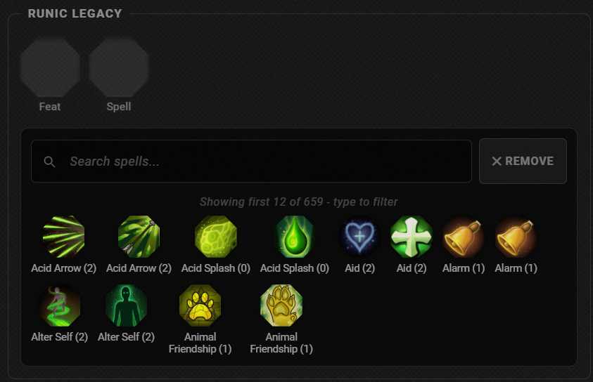

### Presets

Save an item's full rune configuration as a named preset, then load it onto any compatible item.

  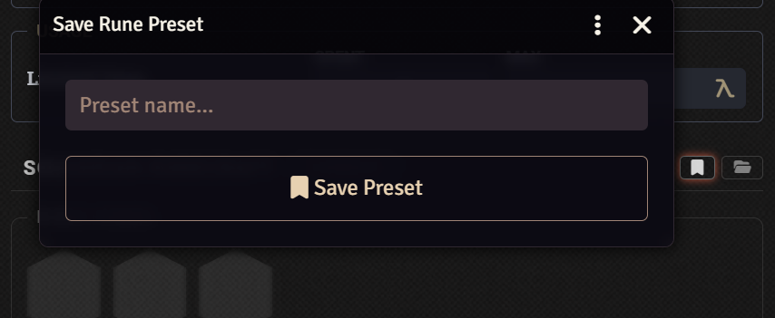
  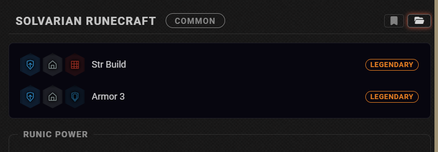

---

## About

Built and maintained by [Elemor](https://patreon.com/Elemor).

If you find this useful and want to support continued development, the Patreon link above is the best way to do that.

Bug reports and feature requests are welcome via the Issues tab.
